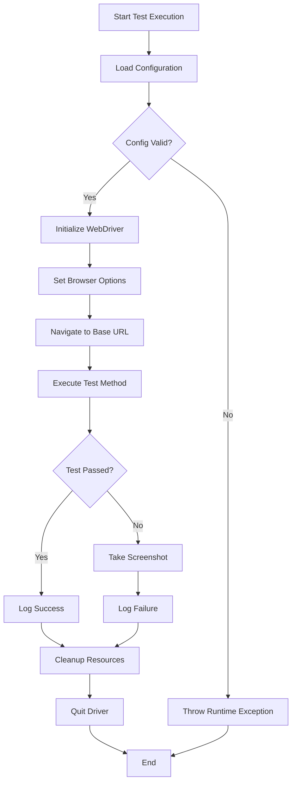
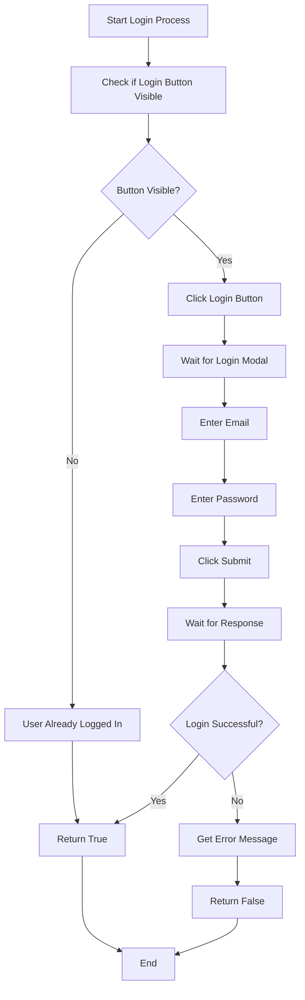
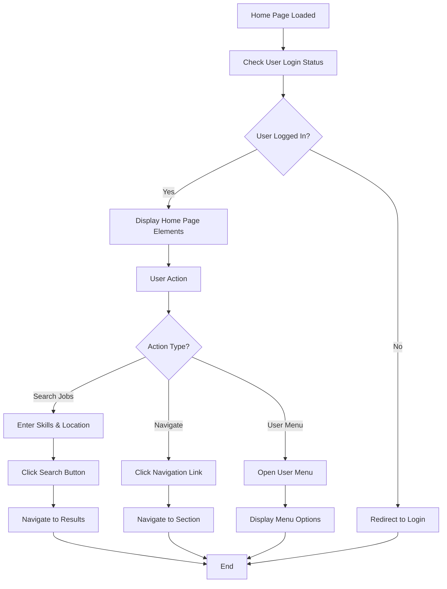
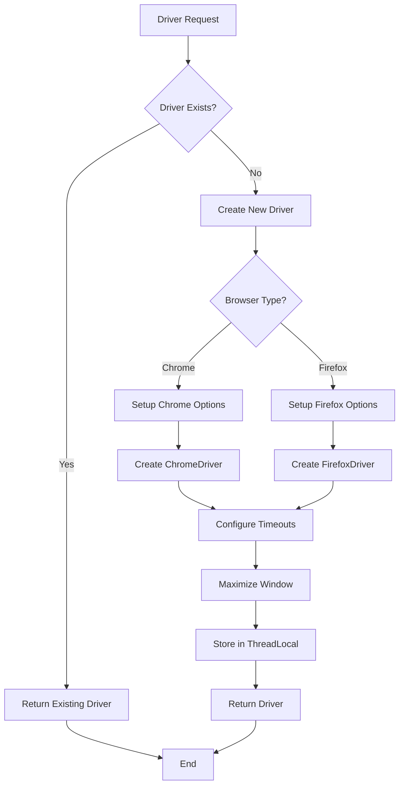
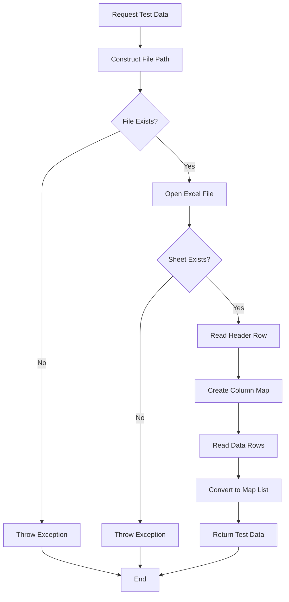
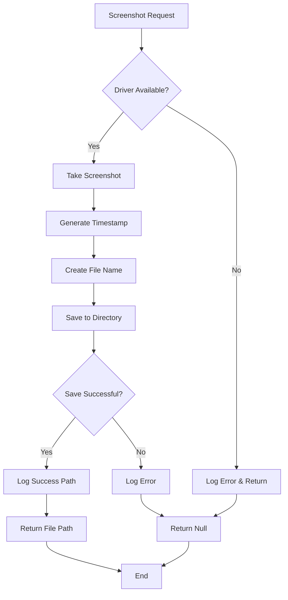
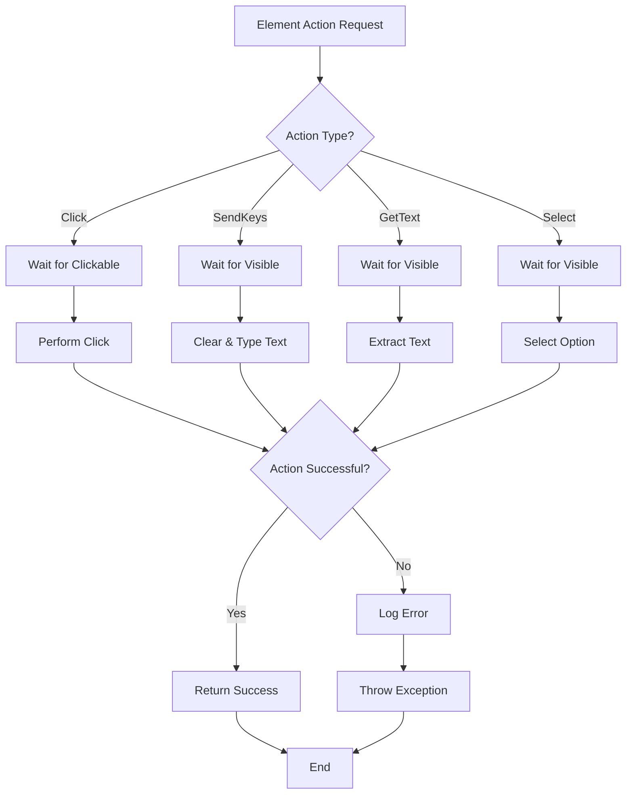
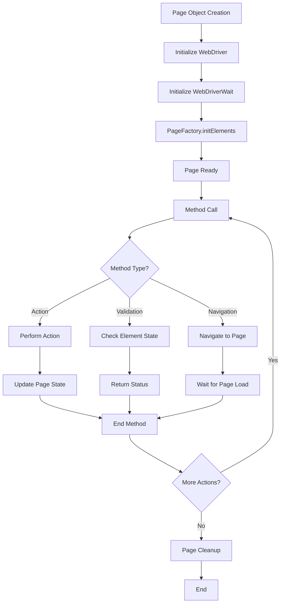
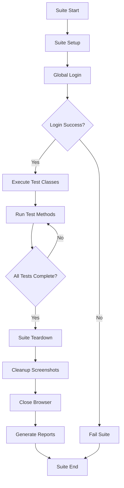
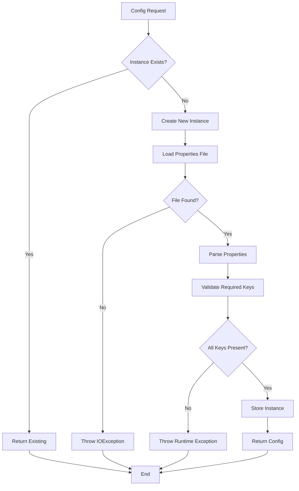

# Naukri Framework - Detailed Flowcharts

## 🔄 Main Test Execution Flow



## 🔐 Login Process Flow



## 🏠 Home Page Interaction Flow



## 🛠️ Driver Management Flow



## 📊 Test Data Management Flow



## 📸 Screenshot Management Flow



## 🔧 Element Interaction Flow



## 🎯 Page Object Lifecycle



## 🧪 Test Suite Execution Flow



## 📋 Configuration Loading Flow



## 🎨 Method Usage Patterns

### Configuration Usage
```java
// Singleton pattern - always use getInstance()
ConfigManager config = ConfigManager.getInstance();
String url = config.getBaseUrl();
int timeout = config.getIntProperty("timeout", 10);
```

### Driver Usage
```java
// Initialize once per test
WebDriver driver = DriverManager.initializeDriver();
// Use throughout test
WebDriver sameDriver = DriverManager.getDriver();
// Cleanup at end
DriverManager.quitDriver();
```

### Element Interaction
```java
// Safe interactions with built-in waits
ElementUtils.click(element);
ElementUtils.sendKeys(element, "text");
String text = ElementUtils.getText(element);
```

### Page Object Usage
```java
// Create page object
LoginPage loginPage = new LoginPage();
// Verify page loaded
if (loginPage.isPageLoaded()) {
    // Perform actions
    loginPage.performLogin(email, password);
}
```

This comprehensive flowchart documentation helps developers understand:
- **Process Flow**: How each component works internally
- **Decision Points**: Where the framework makes choices
- **Error Handling**: How failures are managed
- **Integration**: How components work together
- **Usage Patterns**: Best practices for using each component